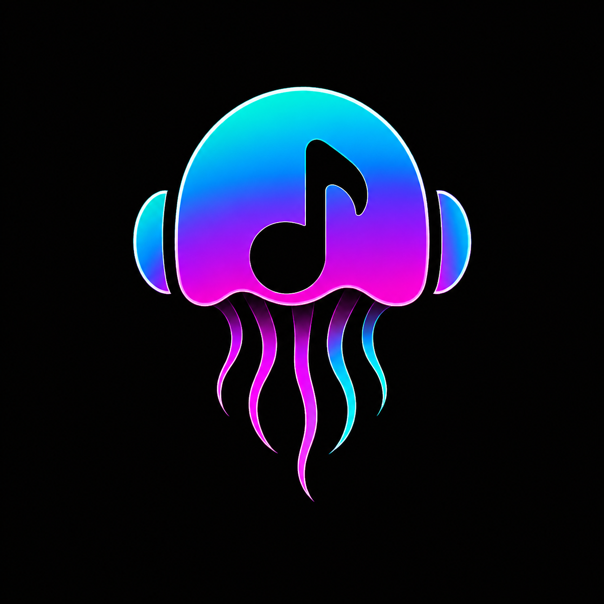

<div align="center">
  
  <h1>Meduza 🎵</h1>
  <p><strong>Open Source Android YouTube Music Player | Free Spotify Alternative</strong></p>
  <p><em>Gapless playback, smart recommendations, ExoPlayer Media3 | Made with ❤️ by Akyyra</em></p>
</div>

<br/>

Meduza - Open source Android YouTube Music player. Free Spotify alternative with smart recommendations, gapless playback, ExoPlayer Media3. Experience state-of-the-art music playback featuring the **MEDUZA Intelligence Engine** — a multi-signal music recommendation algorithm designed to outperform Spotify and YouTube Music's suggestions in a sleek, dynamic cyberpunk-inspired interface.

---

## ✨ Features

### 🧠 MEDUZA Intelligence Engine
- **Taste Affinity Scoring** — Learns which artists you love and weights the queue accordingly
- **Energy Arc Scheduling** — Matches music to time-of-day mood (morning = upbeat, night = ambient)
- **Recency Decay** — Prevents recently played songs from dominating the queue
- **Diversity Windows** — 5-song sliding window prevents same-artist clustering
- **Mood Tag Heuristics** — Detects "chill", "epic", "dance", "lofi" from title/artist keywords
- **Intelligent Normal Play** — Even non-shuffle mode is smart — not linear

### 🎨 Dynamic Theme Engine
- Choose from **13 accent colors** (Red → Rose)
- One hue auto-derives: background, surfaces, borders, gradients, neon glow
- Live preview — the entire app re-renders instantly

### 🎧 Playback
- YouTube Music streaming via yt-innertube (no API key needed)
- Infinite intelligent radio queue
- Gapless playback with pre-resolved stream URLs
- Auto-skip on stream errors
- Disc artwork animation

### 📚 Library
- Local audio file support with MediaStore integration
- Storage permission handling for Android 13+

---

## 📱 Screenshots

> _Coming soon_

---

## 🆚 vs Other Players
| Feature | Meduza | ViMusic | YouTube Music |
| --- | --- | --- | --- |
| Smart recommendations | Yes - Taste Affinity | Basic | Yes |
| Open source | Yes | Yes | No |

---

## 🏗️ Architecture

```
meduza/
├── app/
│   └── src/main/java/com/example/meduza/
│       ├── MainActivity.kt              # Activity + theme state
│       ├── MainViewModel.kt             # Home, search, library data
│       ├── core/settings/
│       │   └── SettingsManager.kt       # All user preferences
│       ├── data/
│       │   ├── model/                   # Domain models
│       │   └── repository/             # Data access (online + local)
│       ├── playback/
│       │   ├── MeduzaIntelligenceEngine.kt  # ★ The brain
│       │   ├── PlaybackViewModel.kt         # Player logic + bridge
│       │   └── MeduzaPlaybackService.kt     # ExoPlayer media3 service
│       └── ui/
│           ├── theme/
│           │   ├── MeduzaThemeEngine.kt     # ★ HSL color derivation
│           │   ├── Theme.kt                 # MaterialTheme + LocalMeduzaColors
│           │   └── MeduzaColors.kt          # Color constants + utilities
│           ├── components/                  # Shared UI components
│           └── screens/                     # Screens (home, search, library, player, settings)
└── innertube/                           # YouTube Music API client (forked from ArchiveTune)
```

See [ARCHITECTURE.md](ARCHITECTURE.md) for a full data-flow diagram.

---

## 🚀 Getting Started

### Prerequisites
- Android Studio Hedgehog or newer
- JDK 17
- Android SDK 26+

### Build
```bash
git clone https://github.com/akyyra/meduza.git
cd meduza
./gradlew assembleDebug
```

No API keys required. The app uses YouTube Music's anonymous innertube endpoints.

---

## 🤝 Contributing

We welcome contributions from the community! See [CONTRIBUTING.md](CONTRIBUTING.md) for guidelines.

---

## ⚖️ License

Licensed under the Apache 2.0 License. See the [LICENSE](LICENSE) file for more details.

---

<div align="center">

**Made with ❤️ by Akyyra**

</div>
